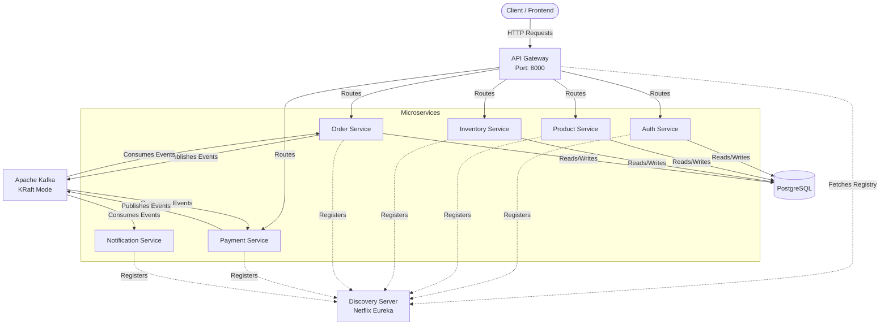
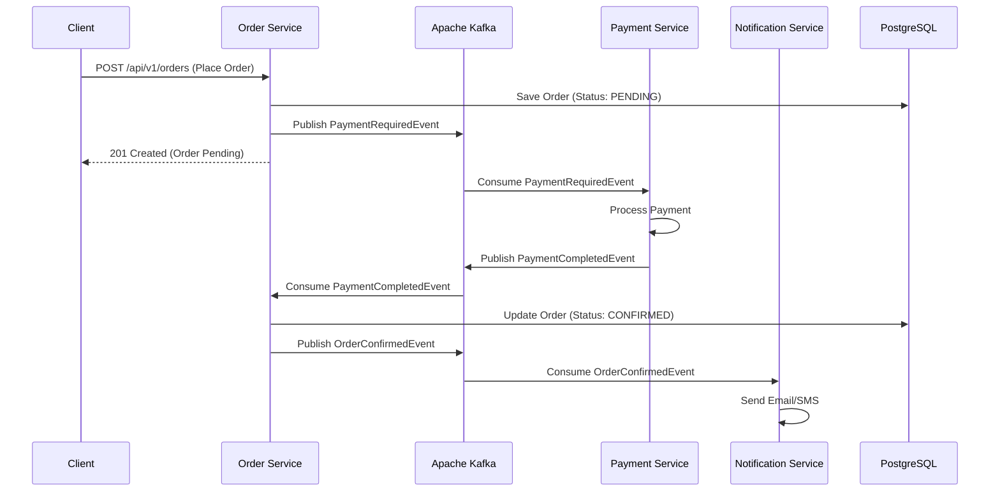

# Nexus Market — Microservices Ecosystem

A scalable, decoupled e-commerce backend infrastructure built using Spring Cloud, microservices design patterns, and containerized relational storage. This project showcases a fully configured service mesh engineered to handle real-time service discovery, dynamic routing, asynchronous event-driven communication, and isolated data schemas.

---

## 🏗️ System Architecture Overview

The system architecture utilizes a robust API Gateway pattern, service registry for dynamic scaling, and an event-driven message broker for decoupled inter-service communication.



---

## 🔄 Event-Driven Order Saga

Nexus Market relies on **Apache Kafka** to handle complex, multi-service transactions like the checkout process without relying on synchronous, blocking HTTP calls.



---

## 🛠️ Microservices Breakdown

1. **API Gateway (`api-gateway`)**: Built with Spring Cloud Gateway. Acts as the single entry point for all client requests, routing them to the appropriate microservices. Handles CORS and forwards requests based on path configurations.
2. **Discovery Server (`discovery-server`)**: Built with Netflix Eureka. Acts as a service registry where all microservices register themselves, enabling dynamic service discovery and client-side load balancing.
3. **Auth Service (`auth-service`)**: Handles user authentication, registration, and JWT token generation.
4. **Product Service (`product-service`)**: Manages the product catalog.
5. **Inventory Service (`inventory-service`)**: Tracks stock levels and manages inventory reservations.
6. **Order Service (`order-service`)**: Handles order placement and acts as the orchestrator for the order fulfillment saga using Kafka events.
7. **Payment Service (`payment-service`)**: Listens for payment requests from the Order Service via Kafka, processes payments asynchronously, and emits payment completion events.
8. **Notification Service (`notification-service`)**: Listens for various domain events (e.g., `OrderConfirmedEvent`) and dispatches notifications (e.g., email or SMS).

---

## 💻 Tech Stack

- **Framework**: Spring Boot 3, Spring Cloud
- **Language**: Java 21
- **Message Broker**: Apache Kafka (KRaft mode)
- **Database**: PostgreSQL (Containerized with isolated schemas)
- **Containerization**: Docker & Docker Compose
- **Build Tool**: Maven

---

## 🚀 Getting Started

### Prerequisites
- Docker and Docker Compose
- JDK 21 (optional, for local development without Docker)
- Maven

### Running with Docker Compose

1. **Clone the repository**
   ```bash
   git clone https://github.com/Tirthankarpal/nexus-market-microservices.git
   cd nexus-market-microservices
   ```

2. **Build and start the infrastructure**
   ```bash
   docker compose -f docker-compose.prod.yml up -d --build
   ```
   *Note: Use `docker-compose.yml` for local development configurations.*

3. **Verify Services**
   - **Discovery Server (Eureka UI)**: `http://localhost:8761`
   - **API Gateway**: `http://localhost:8000`
